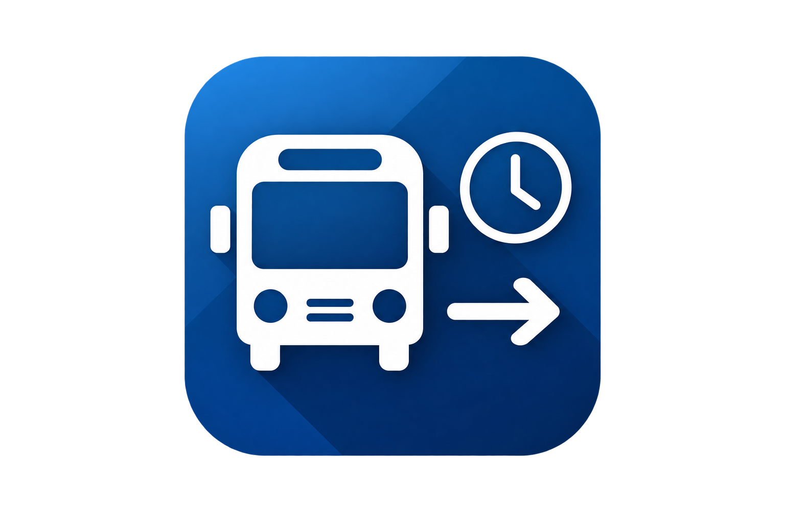

# Västtrafik Departures

<p align="center">
  
</p>

<p align="center">
  A Home Assistant integration for Västtrafik journey and departure information.
</p>

<p align="center">
  <a href="https://my.home-assistant.io/redirect/hacs_repository/?owner=ulf-tallmyr&repository=ha-vasttrafik&category=integration">
    
  </a>
</p>

<p align="center">
  <a href="https://github.com/ulf-tallmyr/ha-vasttrafik/releases">
    
  </a>
  <a href="https://github.com/ulf-tallmyr/ha-vasttrafik/actions/workflows/validate.yml">
    
  </a>
  <a href="https://pypi.org/project/pyvasttrafik/">
    
  </a>
  
  
</p>

---

## Features

- Native Home Assistant Config Flow
- Multiple routes using Config Subentries
- One Home Assistant device per configured route
- Custom route names
- Configurable refresh interval per route
- Real-time journey and departure information
- Delay and cancellation status
- Support for buses, trams, trains, ferries and taxi
- Automatic cleanup when a route is removed
- English and Swedish translations
- Dashboard-friendly departure board
- HACS support

---

## Installation

### HACS

1. Open **HACS**.
2. Add this repository as a custom repository:
   `https://github.com/ulf-tallmyr/ha-vasttrafik`
3. Select category **Integration**.
4. Install **Västtrafik Departures**.
5. Restart Home Assistant.
6. Go to **Settings → Devices & Services → Add Integration**.
7. Search for **Västtrafik Departures**.

### Manual installation

Copy:

```text
custom_components/vasttrafik_departures
```

to:

```text
config/custom_components/vasttrafik_departures
```

Restart Home Assistant.

---

## API credentials

You need your own application in the Västtrafik developer portal with access to **Planera Resa API v4**.

The integration requires:

- Client ID
- Client secret

The credentials are entered in the Home Assistant Config Flow.

---

## Adding routes

After the integration has been added, routes are created as Home Assistant Config Subentries.

For each route:

1. Search for the origin stop.
2. Select the origin.
3. Search for the destination stop.
4. Select the destination.
5. Choose a friendly route name.
6. Choose the refresh interval.

Available refresh intervals:

```text
30 seconds
60 seconds
120 seconds
300 seconds
```

Each route gets its own Home Assistant device and its own set of entities.

---

## Entities

### Sensors

| Sensor | Description |
|---|---|
| From | Configured origin stop |
| Destination | Configured destination stop |
| Line destination | Destination / short direction shown for the first leg |
| Next departure | Effective departure time |
| Minutes until departure | Minutes remaining |
| Travel duration | Total journey duration |
| Number of changes | Number of transfers |
| Line | Line designation |
| Transport mode | Bus, tram, train, ferry or taxi |
| Platform | Origin platform or stop position |
| Delay | Delay in minutes |
| Status | `on_time`, `delayed` or `cancelled` |
| Departure board | Number of available departure rows |

### Binary sensor

| Binary sensor | Description |
|---|---|
| Cancelled | On if any leg in the next journey is cancelled |

---

## Destination vs Line destination

These are intentionally separate.

**Destination** is the stop you selected when configuring the route.

**Line destination** is the short direction reported for the first leg of the journey.

Example:

```text
Destination: Hötorget, Borås
Line destination: Hässleholmen
```

The vehicle can continue beyond your configured destination.

---

## Departure Board

The **Departure board** sensor exposes upcoming departures in the `departures` attribute.

Example:

```yaml
departures:
  - time: "2026-08-14T19:57:00+02:00"
    display_time: "19:57"
    planned_time: "2026-08-14T19:55:00+02:00"
    estimated_time: "2026-08-14T19:57:00+02:00"
    minutes_until: 4
    line: "1"
    direction: "Hässleholmen"
    line_destination: "Hässleholmen"
    transport_mode: "bus"
    platform: "A"
    delay_minutes: 2
    cancelled: false
    status: "delayed"
    number_of_changes: 0
    travel_duration: 16
```

This is useful for custom dashboard cards, templates and automations.

---

## Dashboard example

Replace the example entity IDs with the IDs created in your own Home Assistant installation.

```yaml
type: entities
title: Home → City
entities:
  - sensor.home_to_city_next_departure
  - sensor.home_to_city_minutes_until_departure
  - sensor.home_to_city_line
  - sensor.home_to_city_line_destination
  - sensor.home_to_city_platform
  - sensor.home_to_city_travel_duration
  - sensor.home_to_city_delay
  - sensor.home_to_city_status
  - binary_sensor.home_to_city_cancelled
```

---

## Automation example

Notify when a departure is less than five minutes away:

```yaml
alias: Bus leaves soon
trigger:
  - platform: numeric_state
    entity_id: sensor.home_to_city_minutes_until_departure
    below: 5

condition:
  - condition: state
    entity_id: binary_sensor.home_to_city_cancelled
    state: "off"

action:
  - service: notify.mobile_app_phone
    data:
      message: >
        Line {{ states('sensor.home_to_city_line') }}
        leaves in {{ states('sensor.home_to_city_minutes_until_departure') }} minutes.

mode: single
```

---

## Documentation

- [Configuration](docs/configuration.md)
- [Entity and data reference](docs/api.md)
- [Dashboard examples](docs/dashboard.md)
- [Automation and template examples](docs/examples.md)
- [Troubleshooting](docs/troubleshooting.md)
- [Contributing](CONTRIBUTING.md)
- [Changelog](CHANGELOG.md)

---

## Troubleshooting

If the integration does not load or route data is unavailable, check the Home Assistant logs for:

```text
vasttrafik_departures
```

When reporting problems, never include:

- Client ID
- Client secret
- API tokens
- Other private credentials

See [Troubleshooting](docs/troubleshooting.md) for more information.

---

## Contributing

Bug reports, feature requests and pull requests are welcome.

For larger changes, open an issue first.

See [CONTRIBUTING.md](CONTRIBUTING.md).

---

## License

MIT License.

See [LICENSE](LICENSE).

---

Created by **Ulf Tallmyr**.
